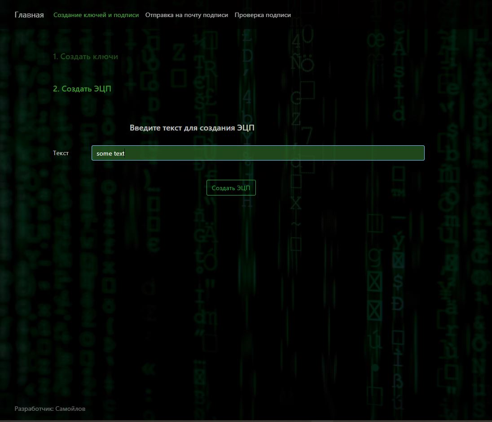
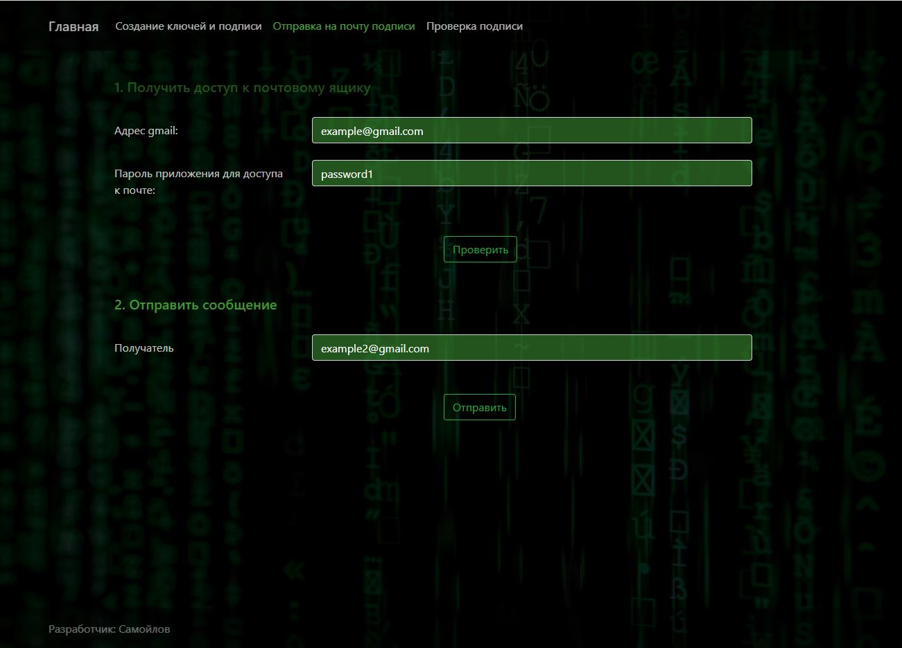
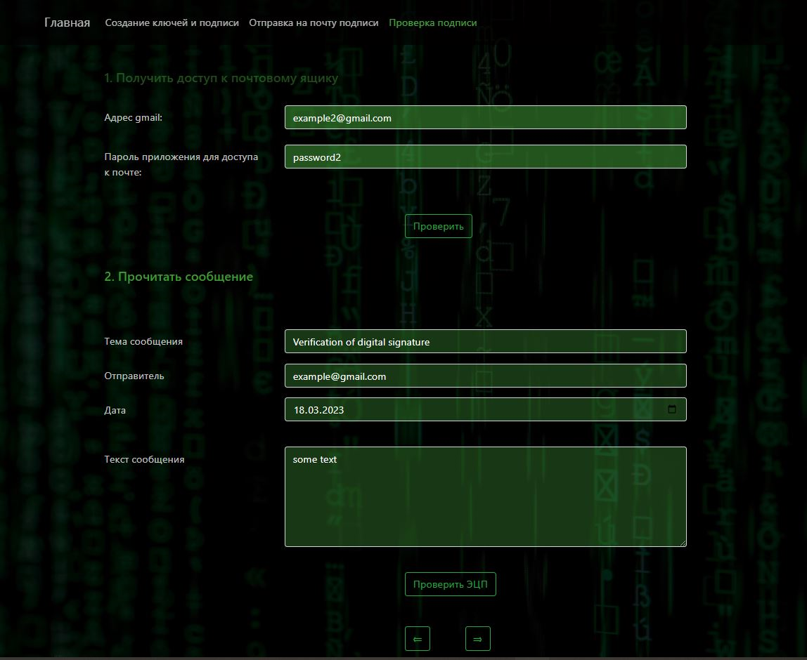

# Интерфейс приложения

## 1. Страница для создания ключей и электронной цифровой подписи по введенной строке

## 2. Страница отправки цифровой подписи, открытого ключа и текста сообщения для проверки подписи

## 3. Cтраница проверки электронной цифровой в сообщении почты

# Запуск приложения

1. Скачайте архив с проектом и войдите в папку Releases 

1. Выберите в зависимости от вашей операционной системы одну из папок

1. Запустите файл CryptLab1WebAppMVC и перейдите в браузере по адресу прослушиваемого порта, например - http://localhost:5000
