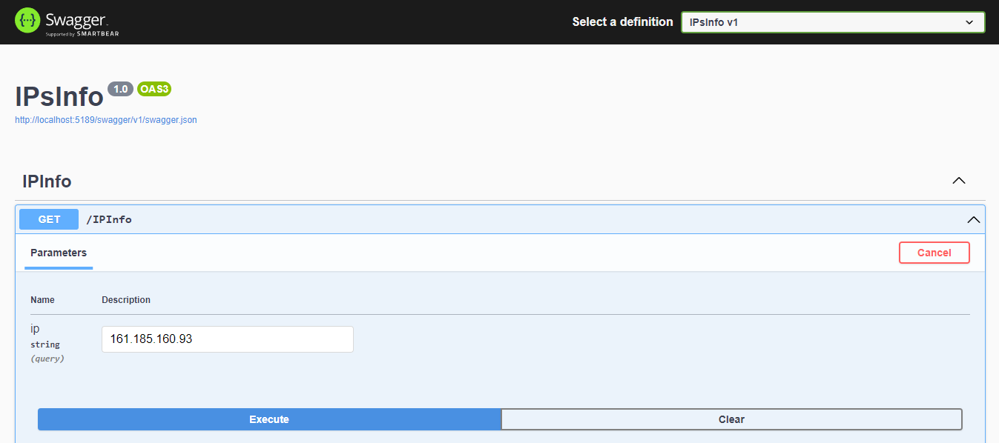
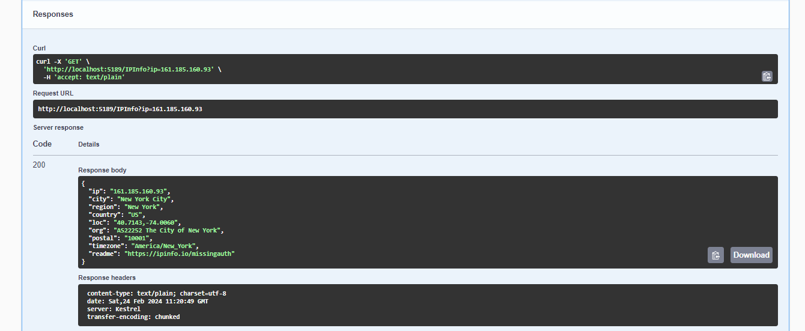

## Task

Develop a .net core application with the following features
1. The service must provide an API access point to obtain information at the specified API address
- The IP address is specified as input (in the url)
- Check your address details here –
https://ipinfo.io/161.185.160.93/geo
- Outwardly give an identical answer
2. The service must provide Swagger so that the service can be tested
3. No authorization required
4. Write the history of unique queries to the database using EF (any database of your choice)

## Screen of solution

